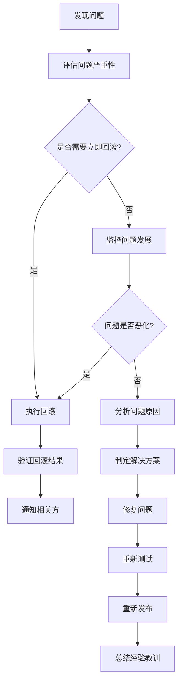

# 灰度发布架构设计文档

## 文档信息
- 文档类型：架构类
- 所属阶段：YYC3-XY-部署发布
- 遵循规范：五高五标五化要求
- 版本号：V1.0
- 创建日期：2025-01-30
- 最后修改：2025-01-30

## 核心内容

---

## 1. 灰度发布概述

### 1.1 灰度发布定义

灰度发布（Canary Release）是一种渐进式软件发布策略，通过将新版本逐步推广到用户群体，以降低发布风险和影响范围。YYC³-XY-AI项目采用灰度发布机制，确保新功能、性能优化和bug修复能够安全、可控地部署到生产环境。

### 1.2 灰度发布目标

- **降低发布风险**：通过小范围验证，避免全量发布导致的服务中断
- **快速发现问题**：在影响有限的情况下及时发现和修复问题
- **平滑用户体验**：确保用户在发布过程中获得稳定的服务体验
- **数据驱动决策**：基于监控数据和用户反馈做出发布决策
- **快速回滚能力**：在发现问题时能够快速回滚到稳定版本

### 1.3 灰度发布适用场景

- **新功能发布**：AI对话功能、智能推荐系统等新功能上线
- **性能优化**：API响应时间优化、数据库查询优化等
- **Bug修复**：关键bug修复后的验证发布
- **架构升级**：微服务拆分、数据库迁移等架构变更
- **依赖更新**：第三方库、框架版本升级

---

## 2. 灰度发布架构设计

### 2.1 整体架构

YYC³-XY-AI项目采用基于Kubernetes和Istio的灰度发布架构，通过流量控制和版本管理实现渐进式发布。

```
┌─────────────────────────────────────────────────────────────┐
│                        用户请求                             │
└──────────────────────┬──────────────────────────────────────┘
                       │
                       ▼
┌─────────────────────────────────────────────────────────────┐
│                     CDN + 负载均衡                          │
│              (CloudFlare / AWS ALB)                         │
└──────────────────────┬──────────────────────────────────────┘
                       │
                       ▼
┌─────────────────────────────────────────────────────────────┐
│                    API网关 (Kong)                           │
│              - 流量路由规则                                  │
│              - 灰度策略配置                                  │
│              - 请求转发                                      │
└──────────────────────┬──────────────────────────────────────┘
                       │
                       ▼
┌─────────────────────────────────────────────────────────────┐
│              Istio Service Mesh (可选)                      │
│              - 流量管理                                      │
│              - 故障注入                                      │
│              - 可观测性                                      │
└──────────────────────┬──────────────────────────────────────┘
                       │
         ┌─────────────┴─────────────┐
         │                           │
         ▼                           ▼
┌─────────────────┐         ┌─────────────────┐
│   稳定版本       │         │   灰度版本       │
│   (Stable)      │         │   (Canary)      │
│                 │         │                 │
│ - v1.2.3        │         │ - v1.3.0        │
│ - 100% → 95%    │         │ - 0% → 5%       │
│                 │         │                 │
└─────────────────┘         └─────────────────┘
         │                           │
         └─────────────┬─────────────┘
                       │
                       ▼
┌─────────────────────────────────────────────────────────────┐
│                    共享基础设施                              │
│  - PostgreSQL (主从复制)                                     │
│  - Redis Cluster                                            │
│  - Qdrant Cluster                                           │
│  - MinIO / S3                                               │
└─────────────────────────────────────────────────────────────┘
```

### 2.2 核心组件

#### 2.2.1 API网关流量控制

Kong网关作为流量入口，负责执行灰度发布策略：

```yaml
# Kong灰度发布路由配置
services:
  - name: yyc3-xy-api-service
    url: http://yyc3-xy-api:1229

routes:
  - name: yyc3-xy-api-route
    service: yyc3-xy-api-service
    paths:
      - /api/v1
    strip_path: false

plugins:
  - name: canary-release
    config:
      percentage: 5
      upstream_host_header: canary.yyc3-xy-api
      traffic_percentage_type: weight
      whitelisted_ips:
        - 192.168.1.0/24
      whitelisted_cookies:
        - name: yyc3_canary
          value: enabled
      whitelisted_headers:
        - name: x-canary-test
          value: true
```

#### 2.2.2 Kubernetes部署策略

使用Kubernetes Deployment和Service实现版本管理：

```yaml
# 稳定版本部署
apiVersion: apps/v1
kind: Deployment
metadata:
  name: yyc3-xy-api-stable
  labels:
    app: yyc3-xy-api
    version: stable
spec:
  replicas: 10
  selector:
    matchLabels:
      app: yyc3-xy-api
      version: stable
  template:
    metadata:
      labels:
        app: yyc3-xy-api
        version: stable
    spec:
      containers:
      - name: api
        image: registry.yyc3.com/yyc3-xy-api:v1.2.3
        ports:
        - containerPort: 1229
        env:
        - name: NODE_ENV
          value: "production"
        - name: VERSION
          value: "v1.2.3"
        resources:
          requests:
            cpu: 500m
            memory: 512Mi
          limits:
            cpu: 1000m
            memory: 1Gi
        livenessProbe:
          httpGet:
            path: /health
            port: 1229
          initialDelaySeconds: 30
          periodSeconds: 10
        readinessProbe:
          httpGet:
            path: /ready
            port: 1229
          initialDelaySeconds: 10
          periodSeconds: 5

---
# 灰度版本部署
apiVersion: apps/v1
kind: Deployment
metadata:
  name: yyc3-xy-api-canary
  labels:
    app: yyc3-xy-api
    version: canary
spec:
  replicas: 1
  selector:
    matchLabels:
      app: yyc3-xy-api
      version: canary
  template:
    metadata:
      labels:
        app: yyc3-xy-api
        version: canary
    spec:
      containers:
      - name: api
        image: registry.yyc3.com/yyc3-xy-api:v1.3.0
        ports:
        - containerPort: 1229
        env:
        - name: NODE_ENV
          value: "production"
        - name: VERSION
          value: "v1.3.0"
        - name: CANARY_MODE
          value: "true"
        resources:
          requests:
            cpu: 100m
            memory: 128Mi
          limits:
            cpu: 200m
            memory: 256Mi
        livenessProbe:
          httpGet:
            path: /health
            port: 1229
          initialDelaySeconds: 30
          periodSeconds: 10
        readinessProbe:
          httpGet:
            path: /ready
            port: 1229
          initialDelaySeconds: 10
          periodSeconds: 5

---
# Service配置
apiVersion: v1
kind: Service
metadata:
  name: yyc3-xy-api
spec:
  selector:
    app: yyc3-xy-api
  ports:
  - port: 1229
    targetPort: 1229
  type: ClusterIP
```

#### 2.2.3 Istio流量管理（可选）

对于更复杂的流量控制场景，使用Istio Service Mesh：

```yaml
# Istio VirtualService配置
apiVersion: networking.istio.io/v1beta1
kind: VirtualService
metadata:
  name: yyc3-xy-api
spec:
  hosts:
  - yyc3-xy-api
  http:
  - match:
    - headers:
        x-canary-test:
          exact: "true"
    route:
    - destination:
        host: yyc3-xy-api
        subset: canary
      weight: 100
  - route:
    - destination:
        host: yyc3-xy-api
        subset: stable
      weight: 95
    - destination:
        host: yyc3-xy-api
        subset: canary
      weight: 5

---
# Istio DestinationRule配置
apiVersion: networking.istio.io/v1beta1
kind: DestinationRule
metadata:
  name: yyc3-xy-api
spec:
  host: yyc3-xy-api
  subsets:
  - name: stable
    labels:
      version: stable
  - name: canary
    labels:
      version: canary
```

---

## 3. 流量控制策略

### 3.1 流量分配策略

#### 3.1.1 百分比流量分配

基于用户请求的百分比进行流量分配：

```typescript
/**
 * @file 流量分配策略
 * @description 实现基于百分比的流量分配逻辑
 * @module deployment/traffic-allocation
 * @author YYC³
 * @version 1.0.0
 */

interface TrafficAllocationConfig {
  stablePercentage: number;
  canaryPercentage: number;
  allocationStrategy: 'percentage' | 'user-segment' | 'feature-flag';
}

class TrafficAllocator {
  private config: TrafficAllocationConfig;

  constructor(config: TrafficAllocationConfig) {
    this.config = config;
  }

  /**
   * 判断请求应该路由到哪个版本
   */
  determineRoute(userId: string, requestContext: RequestContext): 'stable' | 'canary' {
    switch (this.config.allocationStrategy) {
      case 'percentage':
        return this.routeByPercentage(userId);
      case 'user-segment':
        return this.routeByUserSegment(userId);
      case 'feature-flag':
        return this.routeByFeatureFlag(userId, requestContext);
      default:
        return 'stable';
    }
  }

  /**
   * 基于百分比的流量路由
   */
  private routeByPercentage(userId: string): 'stable' | 'canary' {
    const hash = this.hashUserId(userId);
    const percentage = (hash % 100) + 1;
    
    return percentage <= this.config.canaryPercentage ? 'canary' : 'stable';
  }

  /**
   * 用户ID哈希
   */
  private hashUserId(userId: string): number {
    let hash = 0;
    for (let i = 0; i < userId.length; i++) {
      const char = userId.charCodeAt(i);
      hash = ((hash << 5) - hash) + char;
      hash = hash & hash;
    }
    return Math.abs(hash);
  }

  /**
   * 基于用户分段的流量路由
   */
  private routeByUserSegment(userId: string): 'stable' | 'canary' {
    const segment = this.getUserSegment(userId);
    const canarySegments = ['alpha-testers', 'beta-testers'];
    
    return canarySegments.includes(segment) ? 'canary' : 'stable';
  }

  /**
   * 获取用户分段
   */
  private getUserSegment(userId: string): string {
    // 从数据库或缓存获取用户分段信息
    return 'regular';
  }

  /**
   * 基于功能开关的流量路由
   */
  private routeByFeatureFlag(userId: string, context: RequestContext): 'stable' | 'canary' {
    const featureFlag = this.getFeatureFlag(userId, context.featureName);
    
    return featureFlag.enabled ? 'canary' : 'stable';
  }

  /**
   * 获取功能开关配置
   */
  private getFeatureFlag(userId: string, featureName: string): { enabled: boolean } {
    // 从配置中心获取功能开关状态
    return { enabled: false };
  }
}

interface RequestContext {
  featureName?: string;
  headers: Record<string, string>;
  cookies: Record<string, string>;
}
```

#### 3.1.2 用户分段流量分配

基于用户属性和分段的流量分配：

```typescript
/**
 * @file 用户分段管理
 * @description 管理用户分段和灰度发布目标用户
 * @module deployment/user-segment
 * @author YYC³
 * @version 1.0.0
 */

interface UserSegment {
  segmentId: string;
  segmentName: string;
  criteria: SegmentCriteria;
  canaryEligible: boolean;
  userCount: number;
}

interface SegmentCriteria {
  userTier?: 'free' | 'premium' | 'enterprise';
  registrationDateRange?: { start: Date; end: Date };
  geographicRegion?: string[];
  userTags?: string[];
  customAttributes?: Record<string, any>;
}

class UserSegmentManager {
  private segments: Map<string, UserSegment>;

  constructor() {
    this.segments = new Map();
    this.initializeDefaultSegments();
  }

  /**
   * 初始化默认用户分段
   */
  private initializeDefaultSegments(): void {
    const defaultSegments: UserSegment[] = [
      {
        segmentId: 'alpha-testers',
        segmentName: 'Alpha测试用户',
        criteria: {
          userTags: ['alpha-tester'],
        },
        canaryEligible: true,
        userCount: 50,
      },
      {
        segmentId: 'beta-testers',
        segmentName: 'Beta测试用户',
        criteria: {
          userTags: ['beta-tester'],
        },
        canaryEligible: true,
        userCount: 500,
      },
      {
        segmentId: 'premium-users',
        segmentName: '付费用户',
        criteria: {
          userTier: 'premium',
        },
        canaryEligible: false,
        userCount: 10000,
      },
      {
        segmentId: 'new-users',
        segmentName: '新注册用户',
        criteria: {
          registrationDateRange: {
            start: new Date(Date.now() - 7 * 24 * 60 * 60 * 1000),
            end: new Date(),
          },
        },
        canaryEligible: true,
        userCount: 2000,
      },
    ];

    defaultSegments.forEach(segment => {
      this.segments.set(segment.segmentId, segment);
    });
  }

  /**
   * 判断用户是否属于灰度发布分段
   */
  isUserInCanarySegment(userId: string): boolean {
    const userSegments = this.getUserSegments(userId);
    
    return userSegments.some(segment => 
      this.segments.get(segment)?.canaryEligible
    );
  }

  /**
   * 获取用户所属分段
   */
  getUserSegments(userId: string): string[] {
    // 从数据库查询用户分段
    return ['regular'];
  }

  /**
   * 添加用户到灰度测试分段
   */
  addUserToCanarySegment(userId: string, segmentId: string): void {
    // 将用户添加到指定分段
  }

  /**
   * 从灰度测试分段移除用户
   */
  removeUserFromCanarySegment(userId: string, segmentId: string): void {
    // 从指定分段移除用户
  }
}
```

### 3.2 流量控制规则

#### 3.2.1 基于IP白名单的流量控制

```typescript
/**
 * @file IP白名单管理
 * @description 管理灰度发布的IP白名单
 * @module deployment/ip-whitelist
 * @author YYC³
 * @version 1.0.0
 */

class IPWhitelistManager {
  private whitelist: Set<string>;
  private cidrWhitelist: string[];

  constructor() {
    this.whitelist = new Set();
    this.cidrWhitelist = [];
  }

  /**
   * 添加IP到白名单
   */
  addIP(ip: string): void {
    this.whitelist.add(ip);
  }

  /**
   * 添加CIDR网段到白名单
   */
  addCIDR(cidr: string): void {
    this.cidrWhitelist.push(cidr);
  }

  /**
   * 检查IP是否在白名单中
   */
  isWhitelisted(ip: string): boolean {
    if (this.whitelist.has(ip)) {
      return true;
    }

    return this.cidrWhitelist.some(cidr => this.isIPInCIDR(ip, cidr));
  }

  /**
   * 检查IP是否在CIDR网段中
   */
  private isIPInCIDR(ip: string, cidr: string): boolean {
    const [network, prefixLength] = cidr.split('/');
    // 实现CIDR匹配逻辑
    return true;
  }

  /**
   * 从白名单移除IP
   */
  removeIP(ip: string): void {
    this.whitelist.delete(ip);
  }

  /**
   * 从白名单移除CIDR网段
   */
  removeCIDR(cidr: string): void {
    this.cidrWhitelist = this.cidrWhitelist.filter(c => c !== cidr);
  }
}
```

#### 3.2.2 基于Cookie和Header的流量控制

```typescript
/**
 * @file 请求头和Cookie管理
 * @description 管理基于请求头和Cookie的流量控制
 * @module deployment/header-cookie-control
 * @author YYC³
 * @version 1.0.0
 */

interface HeaderCookieRule {
  type: 'header' | 'cookie';
  name: string;
  value: string | string[] | RegExp;
  canaryRoute: boolean;
}

class HeaderCookieController {
  private rules: HeaderCookieRule[];

  constructor() {
    this.rules = [];
    this.initializeDefaultRules();
  }

  /**
   * 初始化默认规则
   */
  private initializeDefaultRules(): void {
    this.rules = [
      {
        type: 'header',
        name: 'x-canary-test',
        value: 'true',
        canaryRoute: true,
      },
      {
        type: 'cookie',
        name: 'yyc3_canary',
        value: 'enabled',
        canaryRoute: true,
      },
      {
        type: 'header',
        name: 'x-user-tier',
        value: 'enterprise',
        canaryRoute: false,
      },
    ];
  }

  /**
   * 判断请求是否应该路由到灰度版本
   */
  shouldRouteToCanary(headers: Record<string, string>, cookies: Record<string, string>): boolean {
    for (const rule of this.rules) {
      const value = rule.type === 'header' ? headers[rule.name] : cookies[rule.name];
      
      if (this.matchesRule(value, rule.value)) {
        return rule.canaryRoute;
      }
    }

    return false;
  }

  /**
   * 检查值是否匹配规则
   */
  private matchesRule(value: string | undefined, ruleValue: string | string[] | RegExp): boolean {
    if (!value) return false;

    if (Array.isArray(ruleValue)) {
      return ruleValue.includes(value);
    }

    if (ruleValue instanceof RegExp) {
      return ruleValue.test(value);
    }

    return value === ruleValue;
  }

  /**
   * 添加规则
   */
  addRule(rule: HeaderCookieRule): void {
    this.rules.push(rule);
  }

  /**
   * 移除规则
   */
  removeRule(index: number): void {
    this.rules.splice(index, 1);
  }
}
```

---

## 4. 版本管理机制

### 4.1 版本标识与追踪

```typescript
/**
 * @file 版本管理
 * @description 管理应用版本和发布历史
 * @module deployment/version-management
 * @author YYC³
 * @version 1.0.0
 */

interface Version {
  version: string;
  buildNumber: string;
  gitCommit: string;
  buildDate: Date;
  status: 'stable' | 'canary' | 'deprecated';
  releaseDate?: Date;
  rollbackDate?: Date;
}

interface Release {
  releaseId: string;
  version: Version;
  canaryPercentage: number;
  startTime: Date;
  endTime?: Date;
  status: 'in-progress' | 'completed' | 'rolled-back';
  metrics: ReleaseMetrics;
}

interface ReleaseMetrics {
  totalRequests: number;
  errorRate: number;
  avgResponseTime: number;
  userSatisfaction: number;
  businessMetrics: Record<string, number>;
}

class VersionManager {
  private versions: Map<string, Version>;
  private releases: Map<string, Release>;
  private currentStableVersion: string;
  private currentCanaryVersion: string | null;

  constructor() {
    this.versions = new Map();
    this.releases = new Map();
    this.currentStableVersion = 'v1.2.3';
    this.currentCanaryVersion = null;
  }

  /**
   * 注册新版本
   */
  registerVersion(version: Version): void {
    this.versions.set(version.version, version);
  }

  /**
   * 开始灰度发布
   */
  startCanaryRelease(version: string, initialPercentage: number): Release {
    const release: Release = {
      releaseId: this.generateReleaseId(),
      version: this.versions.get(version)!,
      canaryPercentage: initialPercentage,
      startTime: new Date(),
      status: 'in-progress',
      metrics: {
        totalRequests: 0,
        errorRate: 0,
        avgResponseTime: 0,
        userSatisfaction: 0,
        businessMetrics: {},
      },
    };

    this.releases.set(release.releaseId, release);
    this.currentCanaryVersion = version;

    return release;
  }

  /**
   * 更新灰度发布流量百分比
   */
  updateCanaryPercentage(releaseId: string, newPercentage: number): void {
    const release = this.releases.get(releaseId);
    if (release) {
      release.canaryPercentage = newPercentage;
    }
  }

  /**
   * 完成灰度发布
   */
  completeCanaryRelease(releaseId: string): void {
    const release = this.releases.get(releaseId);
    if (release) {
      release.status = 'completed';
      release.endTime = new Date();
      
      // 将灰度版本升级为稳定版本
      this.promoteToStable(release.version.version);
    }
  }

  /**
   * 回滚灰度发布
   */
  rollbackCanaryRelease(releaseId: string): void {
    const release = this.releases.get(releaseId);
    if (release) {
      release.status = 'rolled-back';
      release.endTime = new Date();
      release.version.rollbackDate = new Date();
      
      // 停止灰度流量
      this.currentCanaryVersion = null;
    }
  }

  /**
   * 将版本升级为稳定版本
   */
  private promoteToStable(version: string): void {
    const oldStable = this.versions.get(this.currentStableVersion);
    if (oldStable) {
      oldStable.status = 'deprecated';
    }

    const newStable = this.versions.get(version);
    if (newStable) {
      newStable.status = 'stable';
      newStable.releaseDate = new Date();
    }

    this.currentStableVersion = version;
    this.currentCanaryVersion = null;
  }

  /**
   * 获取当前稳定版本
   */
  getCurrentStableVersion(): Version {
    return this.versions.get(this.currentStableVersion)!;
  }

  /**
   * 获取当前灰度版本
   */
  getCurrentCanaryVersion(): Version | null {
    return this.currentCanaryVersion 
      ? this.versions.get(this.currentCanaryVersion)! 
      : null;
  }

  /**
   * 生成发布ID
   */
  private generateReleaseId(): string {
    return `release-${Date.now()}-${Math.random().toString(36).substr(2, 9)}`;
  }
}
```

### 4.2 版本兼容性管理

```typescript
/**
 * @file 版本兼容性管理
 * @description 管理不同版本之间的API兼容性
 * @module deployment/version-compatibility
 * @author YYC³
 * @version 1.0.0
 */

interface APIVersion {
  version: string;
  deprecated: boolean;
  sunsetDate?: Date;
  breakingChanges: string[];
  migrationGuide?: string;
}

interface CompatibilityRule {
  fromVersion: string;
  toVersion: string;
  compatible: boolean;
  notes?: string;
}

class VersionCompatibilityManager {
  private apiVersions: Map<string, APIVersion>;
  private compatibilityRules: CompatibilityRule[];

  constructor() {
    this.apiVersions = new Map();
    this.compatibilityRules = [];
    this.initializeAPIVersions();
  }

  /**
   * 初始化API版本
   */
  private initializeAPIVersions(): void {
    const versions: APIVersion[] = [
      {
        version: 'v1.0.0',
        deprecated: true,
        sunsetDate: new Date('2025-03-01'),
        breakingChanges: [],
      },
      {
        version: 'v1.1.0',
        deprecated: false,
        breakingChanges: [],
      },
      {
        version: 'v1.2.0',
        deprecated: false,
        breakingChanges: [
          '字段名变更: userName -> username',
          '响应格式调整: data字段结构变更',
        ],
        migrationGuide: '/docs/migration/v1.1-to-v1.2.md',
      },
      {
        version: 'v1.3.0',
        deprecated: false,
        breakingChanges: [],
      },
    ];

    versions.forEach(v => this.apiVersions.set(v.version, v));
  }

  /**
   * 检查版本兼容性
   */
  checkCompatibility(fromVersion: string, toVersion: string): boolean {
    const rule = this.compatibilityRules.find(
      r => r.fromVersion === fromVersion && r.toVersion === toVersion
    );

    return rule?.compatible ?? true;
  }

  /**
   * 获取版本变更说明
   */
  getVersionChanges(version: string): APIVersion {
    return this.apiVersions.get(version)!;
  }

  /**
   * 添加兼容性规则
   */
  addCompatibilityRule(rule: CompatibilityRule): void {
    this.compatibilityRules.push(rule);
  }
}
```

---

## 5. 监控与回滚机制

### 5.1 监控指标

```typescript
/**
 * @file 灰度发布监控
 * @description 监控灰度发布的各项指标
 * @module deployment/canary-monitoring
 * @author YYC³
 * @version 1.0.0
 */

interface CanaryMetrics {
  version: string;
  timestamp: Date;
  trafficPercentage: number;
  performanceMetrics: PerformanceMetrics;
  errorMetrics: ErrorMetrics;
  businessMetrics: BusinessMetrics;
  userMetrics: UserMetrics;
}

interface PerformanceMetrics {
  avgResponseTime: number;
  p50ResponseTime: number;
  p95ResponseTime: number;
  p99ResponseTime: number;
  throughput: number;
  cpuUsage: number;
  memoryUsage: number;
}

interface ErrorMetrics {
  errorRate: number;
  errorCount: number;
  errorTypes: Record<string, number>;
  criticalErrors: number;
}

interface BusinessMetrics {
  conversionRate: number;
  revenue: number;
  activeUsers: number;
  featureUsage: Record<string, number>;
}

interface UserMetrics {
  satisfactionScore: number;
  feedbackCount: number;
  complaintCount: number;
  sessionDuration: number;
  bounceRate: number;
}

class CanaryMonitor {
  private metricsHistory: CanaryMetrics[];
  private alertThresholds: AlertThresholds;
  private alertCallbacks: AlertCallback[];

  constructor() {
    this.metricsHistory = [];
    this.alertThresholds = this.getDefaultThresholds();
    this.alertCallbacks = [];
  }

  /**
   * 收集监控指标
   */
  collectMetrics(version: string, trafficPercentage: number): CanaryMetrics {
    const metrics: CanaryMetrics = {
      version,
      timestamp: new Date(),
      trafficPercentage,
      performanceMetrics: this.collectPerformanceMetrics(),
      errorMetrics: this.collectErrorMetrics(),
      businessMetrics: this.collectBusinessMetrics(),
      userMetrics: this.collectUserMetrics(),
    };

    this.metricsHistory.push(metrics);
    this.checkAlerts(metrics);

    return metrics;
  }

  /**
   * 收集性能指标
   */
  private collectPerformanceMetrics(): PerformanceMetrics {
    // 从监控系统收集性能数据
    return {
      avgResponseTime: 150,
      p50ResponseTime: 120,
      p95ResponseTime: 300,
      p99ResponseTime: 500,
      throughput: 1000,
      cpuUsage: 45,
      memoryUsage: 60,
    };
  }

  /**
   * 收集错误指标
   */
  private collectErrorMetrics(): ErrorMetrics {
    // 从日志系统收集错误数据
    return {
      errorRate: 0.01,
      errorCount: 10,
      errorTypes: {
        'ValidationError': 5,
        'DatabaseError': 3,
        'NetworkError': 2,
      },
      criticalErrors: 0,
    };
  }

  /**
   * 收集业务指标
   */
  private collectBusinessMetrics(): BusinessMetrics {
    // 从业务系统收集数据
    return {
      conversionRate: 0.15,
      revenue: 5000,
      activeUsers: 1000,
      featureUsage: {
        'ai-chat': 800,
        'smart-recommend': 600,
      },
    };
  }

  /**
   * 收集用户指标
   */
  private collectUserMetrics(): UserMetrics {
    // 从用户反馈系统收集数据
    return {
      satisfactionScore: 4.5,
      feedbackCount: 50,
      complaintCount: 2,
      sessionDuration: 300,
      bounceRate: 0.2,
    };
  }

  /**
   * 检查告警阈值
   */
  private checkAlerts(metrics: CanaryMetrics): void {
    const alerts: Alert[] = [];

    if (metrics.errorMetrics.errorRate > this.alertThresholds.maxErrorRate) {
      alerts.push({
        type: 'error-rate',
        severity: 'critical',
        message: `错误率超过阈值: ${metrics.errorMetrics.errorRate}`,
        metrics,
      });
    }

    if (metrics.performanceMetrics.p95ResponseTime > this.alertThresholds.maxResponseTime) {
      alerts.push({
        type: 'response-time',
        severity: 'warning',
        message: `响应时间超过阈值: ${metrics.performanceMetrics.p95ResponseTime}ms`,
        metrics,
      });
    }

    if (metrics.userMetrics.satisfactionScore < this.alertThresholds.minSatisfaction) {
      alerts.push({
        type: 'user-satisfaction',
        severity: 'warning',
        message: `用户满意度低于阈值: ${metrics.userMetrics.satisfactionScore}`,
        metrics,
      });
    }

    alerts.forEach(alert => this.triggerAlert(alert));
  }

  /**
   * 触发告警
   */
  private triggerAlert(alert: Alert): void {
    this.alertCallbacks.forEach(callback => callback(alert));
  }

  /**
   * 添加告警回调
   */
  addAlertCallback(callback: AlertCallback): void {
    this.alertCallbacks.push(callback);
  }

  /**
   * 获取默认告警阈值
   */
  private getDefaultThresholds(): AlertThresholds {
    return {
      maxErrorRate: 0.05,
      maxResponseTime: 500,
      minSatisfaction: 4.0,
      maxCpuUsage: 80,
      maxMemoryUsage: 85,
    };
  }

  /**
   * 比较两个版本的指标
   */
  compareMetrics(version1: string, version2: string): MetricsComparison {
    const metrics1 = this.getLatestMetrics(version1);
    const metrics2 = this.getLatestMetrics(version2);

    return {
      version1,
      version2,
      performanceDiff: {
        avgResponseTime: metrics2.performanceMetrics.avgResponseTime - metrics1.performanceMetrics.avgResponseTime,
        p95ResponseTime: metrics2.performanceMetrics.p95ResponseTime - metrics1.performanceMetrics.p95ResponseTime,
        throughput: metrics2.performanceMetrics.throughput - metrics1.performanceMetrics.throughput,
      },
      errorDiff: {
        errorRate: metrics2.errorMetrics.errorRate - metrics1.errorMetrics.errorRate,
        errorCount: metrics2.errorMetrics.errorCount - metrics1.errorMetrics.errorCount,
      },
      businessDiff: {
        conversionRate: metrics2.businessMetrics.conversionRate - metrics1.businessMetrics.conversionRate,
        revenue: metrics2.businessMetrics.revenue - metrics1.businessMetrics.revenue,
      },
    };
  }

  /**
   * 获取指定版本的最新指标
   */
  private getLatestMetrics(version: string): CanaryMetrics {
    return this.metricsHistory
      .filter(m => m.version === version)
      .sort((a, b) => b.timestamp.getTime() - a.timestamp.getTime())[0];
  }
}

interface AlertThresholds {
  maxErrorRate: number;
  maxResponseTime: number;
  minSatisfaction: number;
  maxCpuUsage: number;
  maxMemoryUsage: number;
}

interface Alert {
  type: string;
  severity: 'info' | 'warning' | 'critical';
  message: string;
  metrics: CanaryMetrics;
}

type AlertCallback = (alert: Alert) => void;

interface MetricsComparison {
  version1: string;
  version2: string;
  performanceDiff: {
    avgResponseTime: number;
    p95ResponseTime: number;
    throughput: number;
  };
  errorDiff: {
    errorRate: number;
    errorCount: number;
  };
  businessDiff: {
    conversionRate: number;
    revenue: number;
  };
}
```

### 5.2 自动回滚机制

```typescript
/**
 * @file 自动回滚管理
 * @description 实现灰度发布的自动回滚机制
 * @module deployment/auto-rollback
 * @author YYC³
 * @version 1.0.0
 */

interface RollbackCondition {
  type: 'error-rate' | 'response-time' | 'user-satisfaction' | 'custom';
  threshold: number;
  duration: number;
  enabled: boolean;
}

interface RollbackConfig {
  autoRollbackEnabled: boolean;
  rollbackConditions: RollbackCondition[];
  rollbackDelay: number;
  notifyOnRollback: boolean;
}

class AutoRollbackManager {
  private config: RollbackConfig;
  private versionManager: VersionManager;
  private monitor: CanaryMonitor;
  private rollbackHistory: RollbackEvent[];

  constructor(versionManager: VersionManager, monitor: CanaryMonitor) {
    this.versionManager = versionManager;
    this.monitor = monitor;
    this.rollbackHistory = [];
    this.config = this.getDefaultConfig();
    this.setupMonitoring();
  }

  /**
   * 获取默认回滚配置
   */
  private getDefaultConfig(): RollbackConfig {
    return {
      autoRollbackEnabled: true,
      rollbackConditions: [
        {
          type: 'error-rate',
          threshold: 0.1,
          duration: 5,
          enabled: true,
        },
        {
          type: 'response-time',
          threshold: 1000,
          duration: 10,
          enabled: true,
        },
        {
          type: 'user-satisfaction',
          threshold: 3.0,
          duration: 15,
          enabled: true,
        },
      ],
      rollbackDelay: 0,
      notifyOnRollback: true,
    };
  }

  /**
   * 设置监控
   */
  private setupMonitoring(): void {
    this.monitor.addAlertCallback((alert) => {
      if (this.config.autoRollbackEnabled) {
        this.evaluateRollback(alert);
      }
    });
  }

  /**
   * 评估是否需要回滚
   */
  private evaluateRollback(alert: Alert): void {
    const condition = this.config.rollbackConditions.find(
      c => c.type === alert.type && c.enabled
    );

    if (!condition) return;

    const shouldRollback = this.checkRollbackCondition(alert, condition);

    if (shouldRollback) {
      this.executeRollback(alert);
    }
  }

  /**
   * 检查回滚条件
   */
  private checkRollbackCondition(alert: Alert, condition: RollbackCondition): boolean {
    switch (condition.type) {
      case 'error-rate':
        return alert.metrics.errorMetrics.errorRate > condition.threshold;
      
      case 'response-time':
        return alert.metrics.performanceMetrics.p95ResponseTime > condition.threshold;
      
      case 'user-satisfaction':
        return alert.metrics.userMetrics.satisfactionScore < condition.threshold;
      
      default:
        return false;
    }
  }

  /**
   * 执行回滚
   */
  private executeRollback(alert: Alert): void {
    const canaryVersion = this.versionManager.getCurrentCanaryVersion();
    if (!canaryVersion) return;

    const release = this.findActiveRelease(canaryVersion.version);
    if (!release) return;

    // 延迟回滚
    setTimeout(() => {
      this.versionManager.rollbackCanaryRelease(release.releaseId);
      
      const rollbackEvent: RollbackEvent = {
        eventId: this.generateEventId(),
        version: canaryVersion.version,
        timestamp: new Date(),
        reason: alert.message,
        metrics: alert.metrics,
        successful: true,
      };

      this.rollbackHistory.push(rollbackEvent);

      if (this.config.notifyOnRollback) {
        this.notifyRollback(rollbackEvent);
      }
    }, this.config.rollbackDelay);
  }

  /**
   * 查找活跃的发布
   */
  private findActiveRelease(version: string): Release | undefined {
    for (const release of this.versionManager['releases'].values()) {
      if (release.version.version === version && release.status === 'in-progress') {
        return release;
      }
    }
    return undefined;
  }

  /**
   * 通知回滚事件
   */
  private notifyRollback(event: RollbackEvent): void {
    // 发送通知到团队
    console.log(`[Rollback Alert] Version ${event.version} rolled back due to: ${event.reason}`);
  }

  /**
   * 生成事件ID
   */
  private generateEventId(): string {
    return `rollback-${Date.now()}-${Math.random().toString(36).substr(2, 9)}`;
  }

  /**
   * 手动触发回滚
   */
  manualRollback(version: string, reason: string): void {
    const release = this.findActiveRelease(version);
    if (!release) {
      throw new Error(`No active release found for version ${version}`);
    }

    this.versionManager.rollbackCanaryRelease(release.releaseId);

    const rollbackEvent: RollbackEvent = {
      eventId: this.generateEventId(),
      version,
      timestamp: new Date(),
      reason: `Manual rollback: ${reason}`,
      metrics: this.monitor.collectMetrics(version, 0),
      successful: true,
    };

    this.rollbackHistory.push(rollbackEvent);
  }

  /**
   * 获取回滚历史
   */
  getRollbackHistory(): RollbackEvent[] {
    return this.rollbackHistory;
  }

  /**
   * 更新回滚配置
   */
  updateConfig(config: Partial<RollbackConfig>): void {
    this.config = { ...this.config, ...config };
  }
}

interface RollbackEvent {
  eventId: string;
  version: string;
  timestamp: Date;
  reason: string;
  metrics: CanaryMetrics;
  successful: boolean;
}
```

---

## 6. 实施流程

### 6.1 灰度发布流程

```typescript
/**
 * @file 灰度发布流程
 * @description 定义灰度发布的完整流程
 * @module deployment/canary-workflow
 * @author YYC³
 * @version 1.0.0
 */

interface CanaryReleasePlan {
  version: string;
  initialPercentage: number;
  incrementSteps: number[];
  durationPerStep: number;
  successCriteria: SuccessCriteria;
  rollbackPlan: RollbackPlan;
}

interface SuccessCriteria {
  maxErrorRate: number;
  maxResponseTime: number;
  minSatisfaction: number;
  minConversionRate: number;
}

interface RollbackPlan {
  autoRollback: boolean;
  rollbackDelay: number;
  notificationChannels: string[];
}

class CanaryReleaseWorkflow {
  private versionManager: VersionManager;
  private monitor: CanaryMonitor;
  private rollbackManager: AutoRollbackManager;

  constructor() {
    this.versionManager = new VersionManager();
    this.monitor = new CanaryMonitor();
    this.rollbackManager = new AutoRollbackManager(this.versionManager, this.monitor);
  }

  /**
   * 执行灰度发布
   */
  async executeCanaryRelease(plan: CanaryReleasePlan): Promise<ReleaseResult> {
    console.log(`Starting canary release for version ${plan.version}`);

    const release = this.versionManager.startCanaryRelease(
      plan.version,
      plan.initialPercentage
    );

    try {
      for (let i = 0; i < plan.incrementSteps.length; i++) {
        const percentage = plan.incrementSteps[i];
        const duration = plan.durationPerStep;

        console.log(`Step ${i + 1}: Increasing traffic to ${percentage}%`);

        this.versionManager.updateCanaryPercentage(release.releaseId, percentage);

        await this.monitorStep(plan.version, percentage, duration, plan.successCriteria);

        console.log(`Step ${i + 1} completed successfully`);
      }

      this.versionManager.completeCanaryRelease(release.releaseId);

      return {
        success: true,
        version: plan.version,
        releaseId: release.releaseId,
        message: 'Canary release completed successfully',
      };

    } catch (error) {
      console.error(`Canary release failed: ${error.message}`);

      this.versionManager.rollbackCanaryRelease(release.releaseId);

      return {
        success: false,
        version: plan.version,
        releaseId: release.releaseId,
        message: `Canary release failed and rolled back: ${error.message}`,
      };
    }
  }

  /**
   * 监控发布步骤
   */
  private async monitorStep(
    version: string,
    percentage: number,
    duration: number,
    criteria: SuccessCriteria
  ): Promise<void> {
    const startTime = Date.now();
    const endTime = startTime + duration * 60 * 1000;

    while (Date.now() < endTime) {
      const metrics = this.monitor.collectMetrics(version, percentage);

      this.validateMetrics(metrics, criteria);

      await this.sleep(60000); // 每分钟检查一次
    }
  }

  /**
   * 验证指标
   */
  private validateMetrics(metrics: CanaryMetrics, criteria: SuccessCriteria): void {
    if (metrics.errorMetrics.errorRate > criteria.maxErrorRate) {
      throw new Error(`Error rate exceeded threshold: ${metrics.errorMetrics.errorRate}`);
    }

    if (metrics.performanceMetrics.p95ResponseTime > criteria.maxResponseTime) {
      throw new Error(`Response time exceeded threshold: ${metrics.performanceMetrics.p95ResponseTime}ms`);
    }

    if (metrics.userMetrics.satisfactionScore < criteria.minSatisfaction) {
      throw new Error(`User satisfaction below threshold: ${metrics.userMetrics.satisfactionScore}`);
    }

    if (metrics.businessMetrics.conversionRate < criteria.minConversionRate) {
      throw new Error(`Conversion rate below threshold: ${metrics.businessMetrics.conversionRate}`);
    }
  }

  /**
   * 睡眠指定毫秒数
   */
  private sleep(ms: number): Promise<void> {
    return new Promise(resolve => setTimeout(resolve, ms));
  }
}

interface ReleaseResult {
  success: boolean;
  version: string;
  releaseId: string;
  message: string;
}
```

### 6.2 发布检查清单

```markdown
## 灰度发布前检查清单

### 代码质量
- [ ] 所有单元测试通过
- [ ] 所有集成测试通过
- [ ] 代码审查完成
- [ ] 性能测试通过
- [ ] 安全扫描通过

### 功能验证
- [ ] 新功能在测试环境验证通过
- [ ] 回归测试通过
- [ ] API兼容性验证通过
- [ ] 数据库迁移脚本准备完成
- [ ] 配置文件准备完成

### 监控准备
- [ ] 监控指标配置完成
- [ ] 告警规则配置完成
- [ ] 日志收集配置完成
- [ ] 性能监控配置完成
- [ ] 业务指标配置完成

### 回滚准备
- [ ] 回滚脚本准备完成
- [ ] 回滚流程文档更新
- [ ] 回滚通知渠道配置完成
- [ ] 数据备份完成
- [ ] 回滚测试通过

### 团队准备
- [ ] 发布通知发送
- [ ] 值班人员安排
- [ ] 应急联系人确认
- [ ] 发布时间确认
- [ ] 相关方通知完成

### 文档准备
- [ ] 发布说明文档完成
- [ ] 用户通知文案准备
- [ ] 运维手册更新
- [ ] API文档更新
- [ ] 变更日志更新
```

---

## 7. 最佳实践

### 7.1 灰度发布策略

1. **渐进式流量增长**
   - 初始流量：1-5%
   - 增长步长：5-10%
   - 每步持续时间：30分钟-2小时
   - 最大流量：50%（超过50%建议直接全量发布）

2. **用户分段策略**
   - 优先使用内部测试用户
   - 其次使用Beta测试用户
   - 最后逐步扩展到普通用户
   - 避免将企业用户作为首批灰度对象

3. **时间窗口选择**
   - 选择业务低峰期发布
   - 避免在重大活动期间发布
   - 确保有充足的人员支持
   - 考虑不同时区的用户影响

4. **监控与告警**
   - 实时监控关键指标
   - 设置合理的告警阈值
   - 建立快速响应机制
   - 定期回顾告警规则有效性

### 7.2 回滚策略

1. **快速回滚原则**
   - 发现问题立即回滚
   - 不等待问题确认
   - 优先保证服务稳定性
   - 回滚后再分析问题原因

2. **回滚验证**
   - 回滚后立即验证服务状态
   - 检查关键指标恢复正常
   - 确认用户影响范围
   - 通知相关方回滚完成

3. **回滚后分析**
   - 记录回滚原因和过程
   - 分析问题根本原因
   - 制定修复方案
   - 更新发布流程文档

### 7.3 团队协作

1. **明确职责分工**
   - 发布负责人：统筹发布流程
   - 开发团队：负责代码和功能验证
   - 测试团队：负责质量保证
   - 运维团队：负责基础设施和监控
   - 产品团队：负责业务指标评估

2. **沟通机制**
   - 发布前召开发布会议
   - 发布过程中保持实时沟通
   - 发布后进行复盘总结
   - 建立应急沟通渠道

3. **知识共享**
   - 记录发布经验教训
   - 更新最佳实践文档
   - 培训团队成员
   - 持续改进发布流程

---

## 8. 故障处理

### 8.1 常见问题及解决方案

#### 问题1：灰度版本错误率过高

**症状**：
- 灰度版本错误率超过阈值
- 用户反馈功能异常
- 监控告警触发

**解决方案**：
1. 立即执行回滚
2. 检查错误日志定位问题
3. 修复问题后重新测试
4. 重新启动灰度发布

**预防措施**：
- 加强测试覆盖率
- 实施更严格的代码审查
- 在测试环境充分验证

#### 问题2：性能下降

**症状**：
- 响应时间增加
- CPU/内存使用率上升
- 用户体验变差

**解决方案**：
1. 分析性能瓶颈
2. 优化代码或配置
3. 增加资源分配
4. 必要时回滚

**预防措施**：
- 进行性能测试
- 设置资源限制
- 实施性能监控

#### 问题3：数据不一致

**症状**：
- 数据库数据不一致
- 缓存数据过期
- 用户数据丢失

**解决方案**：
1. 停止灰度流量
2. 检查数据一致性
3. 执行数据修复脚本
4. 回滚到稳定版本

**预防措施**：
- 使用数据库事务
- 实施数据验证
- 定期数据备份

### 8.2 应急响应流程



---

## 9. 相关文档

- [部署架构实施文档](/Users/yanyu/yyc3-xiaoyu-ai/docs/YYC3-XY-部署发布/架构类/01-YYC3-XY-架构类-部署架构实施文档.md)
- [CI_CD流水线架构文档](/Users/yanyu/yyc3-xiaoyu-ai/docs/YYC3-XY-部署发布/架构类/02-YYC3-XY-架构类-CI_CD流水线架构文档.md)
- [多环境部署架构差异文档](/Users/yanyu/yyc3-xiaoyu-ai/docs/YYC3-XY-部署发布/架构类/03-YYC3-XY-架构类-多环境部署架构差异文档.md)
- [微服务架构设计文档](/Users/yanyu/yyc3-xiaoyu-ai/docs/YYC3-XY-架构设计/架构类/02-YYC3-XY-架构类-微服务架构设计文档.md)
- [API网关设计文档](/Users/yanyu/yyc3-xiaoyu-ai/docs/YYC3-XY-架构设计/架构类/03-YYC3-XY-架构类-API网关设计文档.md)

---

## 10. 附录

### 10.1 术语表

| 术语 | 英文 | 说明 |
|------|------|------|
| 灰度发布 | Canary Release | 一种渐进式软件发布策略 |
| 流量分配 | Traffic Allocation | 将用户请求分配到不同版本 |
| 版本管理 | Version Management | 管理应用版本和发布历史 |
| 自动回滚 | Auto Rollback | 自动将系统恢复到稳定版本 |
| 监控指标 | Monitoring Metrics | 用于评估系统性能的指标 |
| 告警阈值 | Alert Threshold | 触发告警的临界值 |

### 10.2 参考资源

- [Kubernetes Deployment Strategies](https://kubernetes.io/docs/concepts/workloads/controllers/deployment/)
- [Istio Traffic Management](https://istio.io/latest/docs/concepts/traffic-management/)
- [Kong Canary Release Plugin](https://docs.konghq.com/hub/kong-inc/canary-release/)
- [Google SRE Book - Release Engineering](https://sre.google/sre-book/release-engineering/)

---

<div align="center">

> 「***YanYuCloudCube***」
> 「***<admin@0379.email>***」
> 「***Words Initiate Quadrants, Language Serves as Core for the Future***」
> 「***All things converge in the cloud pivot; Deep stacks ignite a new era of intelligence***」

</div>
